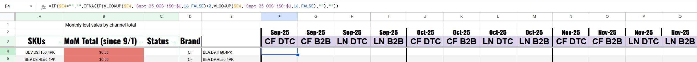

# oos-revenue-impact-model

**Detects product stockouts and estimates potential revenue exposure across DTC and B2B e-commerce channels.**

Tech stack - Shopify, Google Sheets, Apps Script, Node.js, Matrixify

## Overview

This project models the theoretical revenue impact of product stockouts. It spans multiple brands and sales channels. 

The goal was to quantify how much revenue may have been lost when SKUs became unavailable for sale on company website, then frame it visually in a month over month framework.

The model uses forecasted demand and stock availability to estimate the financial exposure associated with inventory stockouts. Historical sales data was not used as a demand proxy (ie., hemp-derived THC / consumer CBD market is too volatile for past sales to reliably predict future demand). This model instead works from forecasted demand and actual stock availability events.

The resulting output is presented in such a way that C suite executives can quickly understand a glance how much revenue was left on the table.

**NOTE** - The model assumes demand is evenly distributed across all days in a month.

## How it works
```
Shopify (inventory source)
↓
Railway (Node.js automation layer)
↓
Matrixify (Shopify data export app)  
↓
Google Sheets (IMPORTDATA CSV grab of inventory snapshots)
↓
Apps Script (1x daily OOS detection)
↓
Aggregation Layer (QUERY based data normalization)
↓
MoM Revenue Impact Model
```

## Stockout Detection Log

Apps Script runs once daily during peak sales activity. Any SKU sitting at zero available inventory gets logged as a stockout event and is timestamped.


## Revenue Exposure Model

Daily out-of-stock events are aggregated into SKU-level revenue exposure estimates across sales channels.

The model organizes revenue impact by month and sales channel. 



## Key Design Decisions

- As previously stated, historical sales data was excluded due to volatility in the hemp-derived THC / CBD market
- Due to systems limitaions, daily inventory snapshots are captured once daily during peak sales activity
- The model assumes demand spreads uniformly across all days in a month

## Repo Structure

/scripts
  snapshotZeroValues.gs        – daily stockout detection (Apps Script)

/docs
  data_dictionary.md           – dataset documentation
